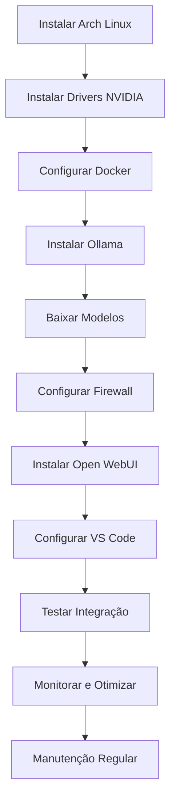

# 🤖 AI Coding Server - Arch Linux + Ollama + Open WebUI

    Servidor local de IA para programação com Qwen3.5, DeepSeek-Coder e CodeGemma, acessível por múltiplos desenvolvedores na rede local. 100% privado, offline e gratuito.

---

## 📋 Índice

- [✨ Funcionalidades](#-funcionalidades)
- [🏗️ Configuração Inicial do Servidor Linux](#-configuração-inicial-do-servidor-linux)
- [🎯 Pré-requisitos](#-pré-requisitos)
- [🚀 Instalação Rápida](#-instalação-rápida)
- [🔧 Instalação Detalhada](#-instalação-detalhada)
- [🤖 Configuração dos Modelos](#-configuração-dos-modelos)
- [🌐 Acesso via Open WebUI](#-acesso-via-open-webui)
- [💻 Integração com VS Code](#-integração-com-vs-code)
- [🔄 Gerenciamento de Modelos](#-gerenciamento-de-modelos)
- [🛠️ Troubleshooting](#-troubleshooting)
- [📊 Monitoramento](#-monitoramento)
- [🔒 Segurança](#-segurança)
- [📁 Compartilhamento de Arquivos](#-compartilhamento-de-arquivos)
- [🤝 Contribuindo](#-contribuindo)
- [📚 Próximas Tarefas Pendentes](#-próximas-tarefas-pendentes)

---

## ✨ Funcionalidades

- 🏆 3 modelos de código otimizados para GPU:
  - `qwen3.5:9b` → Qualidade máxima para tarefas complexas
  - `deepseek-coder:6.7b` → Código rápido e leve
  - `codegemma:7b` → Balanceado para uso geral
- 🎮 Aceleração GPU com NVIDIA RTX 3060 (12GB VRAM)
- 🌐 Acesso multi-usuário via rede local (5+ desenvolvedores simultâneos)
- 🔒 100% privado — dados nunca saem da sua rede
- 💬 Interface web tipo ChatGPT (Open WebUI)
- 🧩 Integração nativa com VS Code via Continue.dev
- 🔄 Troca dinâmica de modelos sem reiniciar servidor
- 📦 Dockerizado para fácil deploy e manutenção

---

## 🏗️ Configuração Inicial do Servidor Linux

> **Nota:** Esta seção assume que você já instalou o Arch Linux (via archinstall ou instalação manual).

### 1. Instalação Base e Ambiente Arch

```bash
# Atualizar o sistema
sudo pacman -Syu

# Instalar utilitários essenciais
sudo pacman -S base-devel linux-headers git vim openssh wget curl

# Instalar ferramentas de gerenciamento de pacotes
sudo pacman -S yay paru

# Habilitar o SSH para gerenciamento remoto
sudo systemctl enable --now sshd
```

**Verificação:**
```bash
# Confirmar que o SSH está rodando
systemctl status sshd

# Testar conexão local
ssh localhost
```

### 2. Configuração da GPU NVIDIA (CUDA & cuDNN)

Para que o TensorFlow e o PyTorch utilizem o hardware, a ordem de instalação importa.

**Importante:** Como você tem uma RTX 3070 LHR e está no kernel LTS, o pacote genérico `nvidia` não vai funcionar. Vamos resolver isso com o método mais robusto para o Arch Linux, que é o DKMS. O DKMS garante que, sempre que o kernel atualizar, o driver da NVIDIA seja recompilado automaticamente.

#### Instalar os Drivers NVIDIA

```bash
# Instalar headers do kernel LTS e drivers
sudo pacman -S linux-lts-headers nvidia-dkms nvidia-utils nvidia-settings

# Instalar toolkit de computação (opcional, para desenvolvimento)
sudo pacman -S cuda cudnn
```

#### Configurar o Bootloader para NVIDIA

```bash
# Editar a configuração do bootloader
sudo nano /boot/loader/entries/2026-02-04_14-38-23_linux-lts.conf
```

**Na linha que começa com `options`, vá até o final e adicione:**
```
nvidia-drm.modeset=1
```

**Resultado esperado:**
```
options root=UUID=xxxx-xxxx ro quiet nvidia-drm.modeset=1
```

#### Blacklistar o Nouveau (Driver Open Source)

```bash
# Criar arquivo de blacklist
sudo nano /etc/modprobe.d/nouveau_blacklist.conf
```

**Adicionar as linhas (mesmo arquivo vazio):**
```
blacklist nouveau
options nouveau modeset=0
```

**Verificar se o nouveau foi blacklistado:**
```bash
lsmod | grep nouveau
# Saída esperada: (nenhum resultado)
```

#### Verificar Detecção da GPU

```bash
# Listar dispositivos NVIDIA
lspci | grep -i nvidia

# Saída esperada:
# 01:00.0 VGA compatible controller: NVIDIA Corporation Device 1fb90 (rev a1)
```

#### Reiniciar o Servidor

```bash
# Reiniciar para aplicar as configurações
sudo reboot
```

#### Verificação Pós-Reinício

```bash
# Verificar se a GPU está sendo detectada
nvidia-smi

# Saída esperada:
# +-----------------------------------------------------------------------------+
# | NVIDIA-SMI 535.104.05   Driver Version: 535.104.05   CUDA Version: 12.2   |
# |-----------------------------------------+----------------------+----------------------+
# | GPU  Name        Persistence-M   Bus-Id   Disp.A   Volatile Uncorr. ECC  |
# | 0  NVIDIA GeForce RTX 3070 LHR       On   000001:00:01.0     On          |
# |-----------------------------------------+----------------------+----------------------+
# |                                                                              
# | Processes:                                                                  |
# |  GPU   GI   CI        PID   Type   Process name                  GPU Memory |
# |        ID   ID        PID   CPU   Name                             Usage      |
# |=============================================================================|
# |  0      N/A  N/A            Process name...                       N/A   |
# +-----------------------------------------------------------------------------+
```

**Monitorar em tempo real:**
```bash
watch -n 2 nvidia-smi
```

**Ou comando único:**
```bash
nvidia-smi --query-gpu=memory.used,memory.total,utilization.gpu --format=csv
```

**Saída exemplo:**
```
memory.used [MiB], memory.total [MiB], utilization.gpu [%]
6144, 12288, 45%
```

### 3. Ambiente de Processamento (Python & Frameworks)

É altamente recomendável usar ambientes virtuais ou Docker para evitar quebrar as bibliotecas do sistema.

#### Opção A: Ambientes Virtuais (Conda/Mamba)

**Instalar o Miniforge (melhor que o Anaconda para Arch):**
```bash
yay -S miniforge-bin
```

**Criar um ambiente dedicado:**
```bash
conda create -n ml_env python=3.10
conda activate ml_env
```

**Instalar os frameworks:**
```bash
# TensorFlow com suporte a CUDA
pip install tensorflow[and-cuda]

# Verificar detecção de GPU
python3 -c "import tensorflow as tf; print(tf.config.list_physical_devices('GPU'))"

# PyTorch completo
pip install torch torchvision torchaudio
```

**Verificar PyTorch com GPU:**
```bash
python3 -c "import torch; print(torch.cuda.is_available())"
# Saída esperada: True
```

#### Opção B: Docker (Recomendado para servidores)

O Docker isola as versões de bibliotecas e facilita a portabilidade.

**Instalar o Docker e o suporte NVIDIA:**
```bash
sudo pacman -S docker nvidia-container-toolkit
```

**Habilitar o serviço Docker:**
```bash
sudo systemctl enable --now docker
```

**Adicionar seu usuário ao grupo docker:**
```bash
sudo usermod -aG docker $USER
# ⚠️ Faça logout/login para aplicar mudanças de grupo
```

**Configurar runtime da NVIDIA no Docker:**
```bash
# Verificar se o runtime está disponível
docker info | grep -i runtime

# Deve mostrar:
# Runtime: runc
# Storage Driver: overlay2
# NVIDIA: true
```

**Testar execução de container com GPU:**
```bash
docker run --gpus all --rm nvidia/cuda:12.1.0-base-ubuntu20.04 nvidia-smi
```

### 4. Servidor Samba (Compartilhamento de Arquivos)

Para que outros PCs (Windows/Linux) na rede local enviem datasets para o servidor.

#### Instalar Samba

```bash
sudo pacman -S samba
```

#### Configurar o Samba

```bash
sudo nano /etc/samba/smb.conf
```

**Adicionar ao final do arquivo:**
```ini
[datasets]
    path = /data/datasets
    available = yes
    valid users = @wheel
    read only = no
    create mask = 0755
    directory mask = 0755
    force group = wheel
    writable = yes

[models]
    path = /var/lib/ollama
    available = yes
    valid users = @wheel
    read only = yes
    create mask = 0644
    directory mask = 0755

[backup]
    path = /data/backup
    available = yes
    valid users = @wheel
    read only = no
    create mask = 0755
    directory mask = 0755
    writable = yes
```

#### Criar Diretórios Compartilhados

```bash
# Criar diretórios de compartilhamento
sudo mkdir -p /data/datasets /data/backup

# Definir permissões
sudo chown -R root:wheel /data
sudo chmod -R 755 /data
```

#### Iniciar o Samba

```bash
# Habilitar e iniciar o serviço
sudo systemctl enable --now smb
sudo systemctl enable --now nmb

# Verificar status
systemctl status smb
systemctl status nmb
```

#### Testar Conexão de Outro PC

**No Windows:**
```
\\192.168.0.177\datasets
\\192.168.0.177\models
\\192.168.0.177\backup
```

**No Linux:**
```bash
mount -t cifs //192.168.0.177/datasets /mnt/datasets -o username=usuario,password=senha
```

---

## 🎯 Pré-requisitos

### Hardware Recomendado

| Componente   | Mínimo          | Recomendado          |
|--------------|-----------------|-----------------------|
| GPU          | NVIDIA 8GB VRAM | NVIDIA 12GB+ VRAM (RTX 3060) |
| RAM          | 16 GB           | 32 GB+                |
| CPU          | 4 núcleos       | 6+ núcleos            |
| Armazenamento| 50 GB livres    | 100 GB+ SSD/NVMe     |
| Rede         | Wi-Fi/Ethernet  | Gigabit Ethernet      |

### Software

- ✅ Arch Linux instalado e atualizado
- ✅ Usuário com privilégios sudo
- ✅ Drivers NVIDIA instalados (nvidia-dkms, nvidia-utils)
- ✅ Conexão com internet para downloads iniciais

---

## 🚀 Instalação Rápida

```bash
# 1. Clonar este repositório (ou copiar os comandos abaixo)
git clone https://github.com/seu-usuario/ai-coding-server.git
cd ai-coding-server

# 2. Executar script de instalação automática
chmod +x install.sh
./install.sh

# 3. Baixar modelos (escolha os desejados)
ollama pull qwen3.5:9b
ollama pull deepseek-coder:6.7b
ollama pull codegemma:7b

# 4. Iniciar serviços
sudo systemctl enable --now ollama
cd ~/openwebui && docker-compose up -d

# 5. Acessar interface web
# http://<IP-DO-SERVIDOR>:3000
```

---

## 🔧 Instalação Detalhada

### 1. Preparar o Sistema

```bash
# Atualizar sistema
sudo pacman -Syu

# Instalar ferramentas essenciais
sudo pacman -S base-devel git wget curl docker docker-compose yay

# Habilitar e iniciar Docker
sudo systemctl enable --now docker
sudo usermod -aG docker $USER
# ⚠️ Faça logout/login para aplicar mudanças de grupo

# Instalar drivers NVIDIA (se ainda não tiver)
sudo pacman -S nvidia-dkms nvidia-utils nvidia-settings cuda cudnn

# Verificar GPU
nvidia-smi
```

### 2. Instalar e Configurar Ollama

```bash
# Instalar Ollama via AUR
yay -S ollama ollama-cuda

# Configurar para rede local e GPU
sudo mkdir -p /etc/systemd/system/ollama.service.d
sudo nano /etc/systemd/system/ollama.service.d/override.conf
```

**Conteúdo do override.conf:**

```ini
[Service]
Environment="OLLAMA_HOST=0.0.0.0:11434"
Environment="OLLAMA_NUM_PARALLEL=5"
Environment="OLLAMA_MAX_LOADED_MODELS=1"
Environment="OLLAMA_KEEP_ALIVE=10m"
Environment="CUDA_VISIBLE_DEVICES=0"
```

```bash
# Aplicar configurações
sudo systemctl daemon-reload
sudo systemctl enable --now ollama

# Verificar status
systemctl status ollama --no-pager
```

### 3. Configurar Firewall (Opcional mas Recomendado)

```bash
# Instalar UFW
sudo pacman -S ufw

# Liberar portas necessárias
sudo ufw allow 11434/tcp  # Ollama API
sudo ufw allow 3000/tcp   # Open WebUI
sudo ufw enable

# Verificar regras
sudo ufw status
```

### 4. Instalar Open WebUI (Interface Web)

```bash
# Criar diretório do projeto
mkdir -p ~/openwebui
cd ~/openwebui

# Criar docker-compose.yml
nano docker-compose.yml
```

**Conteúdo do docker-compose.yml:**

```yaml
services:
  open-webui:
    image: ghcr.io/open-webui/open-webui:main
    container_name: open-webui
    ports:
      - "3000:8080"
    volumes:
      - ./open-webui:/app/backend/data
    environment:
      - 'OLLAMA_BASE_URL=http://host.docker.internal:11434'
      - 'WEBUI_SECRET_KEY=abcde'
      - ENABLE_RAG=false
      - ENABLE_WEB_SEARCH=false
      - ENABLE_COMMUNITY_SHARING=false
      - WEBUI_BIND_HOST=0.0.0.0
      - WEBUI_PORT=8080
    extra_hosts:
      - "host.docker.internal:host-gateway"
    restart: unless-stopped
```

```bash
# Iniciar container
docker-compose up -d

# Verificar logs
docker-compose logs -f
# Aguarde: "Uvicorn running on http://0.0.0.0:8080"
```

---

## 🤖 Configuração dos Modelos

### Baixar Modelos Recomendados

```bash
# Modelo principal (qualidade máxima)
ollama pull qwen3.5:9b          # ~6.6 GB

# Modelo leve para código rápido
ollama pull deepseek-coder:6.7b # ~3.8 GB

# Modelo balanceado
ollama pull codegemma:7b        # ~5.0 GB

# Verificar downloads
ollama list
```

### Verificar Uso de VRAM

```bash
# Monitorar GPU em tempo real
watch -n 2 nvidia-smi

# Ou comando único
nvidia-smi --query-gpu=memory.used,memory.total,utilization.gpu --format=csv
```

💡 **Dica:** Cada modelo 7B usa ~6GB de VRAM. Com `OLLAMA_MAX_LOADED_MODELS=1`, apenas um modelo fica na GPU por vez.

---

## 🌐 Acesso via Open WebUI

### Primeiro Acesso

Abra no navegador: `http://<IP-DO-SERVIDOR>:3000`

Crie sua conta admin:

- Email: `admin@openwebui.local`
- Nome: `Admin`
- Senha: `********`

### Conectar ao Ollama

1. Clique no seu nome → Admin Panel → Settings → Connections
2. Configure:
   - **OLLAMA BASE URL:** `http://<IP-DO-SERVIDOR>:11434`
3. Clique em "Test Connection" ✅
4. Clique em "Save"

### Usar os Modelos

1. Volte para o chat principal
2. Clique no seletor de modelo (topo da página)
3. Escolha um modelo:
   - `qwen3.5:9b` → Tarefas complexas, raciocínio
   - `deepseek-coder:6.7b` → Geração de código rápido
   - `codegemma:7b` → Uso geral balanceado
4. Comece a conversar! 🎉

💡 **Dica:** O Open WebUI funciona às vezes de primeira, mas outras vezes acontecem erros. Se acontecer, siga os passos do [`guia_erros_openWebUI.md`](scr/models_llm/guia_erros_openWebUI.md).

---

## 💻 Integração com VS Code (Continue.dev)

### Instalar em Cada Notebook

1. No VS Code a extensão: `Ctrl+Shift+X` → Busque "Continue" → Instale
2. Abra a paleta: `Ctrl+Shift+P` → "Continue: Open Config"
3. Configure `~/.continue/config.json`:

```json
{
  "models": [
    {
      "title": "🏆 Qwen2.5 14B (Local)",
      "provider": "ollama",
      "model": "qwen2.5-coder:14b",
      "apiBase": "http://<IP-DO-SERVIDOR>:11434"
    },
    {
      "title": "🏆 Qwen3.5 9B (Local)",
      "provider": "ollama",
      "model": "qwen3.5:9b",
      "apiBase": "http://<IP-DO-SERVIDOR>:11434"
    },
    {
      "title": "⚡ DeepSeek 6.7B (Local)",
      "provider": "ollama",
      "model": "deepseek-coder:6.7b",
      "apiBase": "http://<IP-DO-SERVIDOR>:11434"
    },
    {
      "title": "🔷 CodeGemma 7B (Local)",
      "provider": "ollama",
      "model": "codegemma:7b",
      "apiBase": "http://<IP-DO-SERVIDOR>:11434"
    }
  ],
  "tabAutocompleteModel": {
    "title": "⚡ DeepSeek 6.7B (Local)",
    "provider": "ollama",
    "model": "deepseek-coder:6.7b",
    "apiBase": "http://<IP-DO-SERVIDOR>:11434"
  }
}
```

**Exemplo de IP:** `<IP-DO-SERVIDOR> = 192.168.0.177`

### Como Usar

| Atalho         | Função                  | Exemplo              |
|----------------|-------------------------|----------------------|
| `Ctrl+L`       | Chat lateral            | "Explique esta função" |
| `Ctrl+I`       | Edit inline             | "Adicione type hints" |
| `Tab`          | Aceitar autocomplete    | Sugestão enquanto digita |

### Testar Conexão

No terminal do notebook para saber se o servidor ollama está respondendo:

```bash
curl http://<IP-DO-SERVIDOR>:11434/api/tags
# Deve retornar JSON com lista de modelos
```

**Saída:** "run ollama" na página web

---

## 🔄 Gerenciamento de Modelos

### Script de Troca Rápida

Crie `~/switch-model.sh`:

```bash
#!/bin/bash
# ~/switch-model.sh - Troca entre modelos Ollama

OLLAMA_URL="http://127.0.0.1:11434"
MODEL="${1:-qwen3.5:9b}"

echo "=== 🔄 Trocando para: $MODEL ==="

# Descarregar modelo anterior
curl -s -X POST "$OLLAMA_URL/api/generate" \
  -H "Content-Type: application/json" \
  -d "{\"model\": \"$MODEL\", \"prompt\": \".\", \"keep_alive\": 0}" > /dev/null
sleep 3

# Pré-carregar novo modelo
curl -s -X POST "$OLLAMA_URL/api/generate" \
  -H "Content-Type: application/json" \
  -d "{\"model\": \"$MODEL\", \"prompt\": \"ready\", \"keep_alive\": \"24h\"}" > /dev/null

echo "✅ Modelo ativo: $(curl -s $OLLAMA_URL/api/ps | grep -oP '"model":\s*"\K[^"]+' || echo 'Verificando...')"
echo "🎮 VRAM: $(nvidia-smi --query-gpu=memory.used --format=csv,noheader | tail -1)"
```

```bash
# Tornar executável
chmod +x ~/switch-model.sh

# Adicionar aliases ao ~/.bashrc
cat >> ~/.bashrc << 'EOF'

# === AI Model Switcher ===
alias ai-qwen='~/switch-model.sh qwen3.5:9b'
alias ai-deepseek='~/switch-model.sh deepseek-coder:6.7b'
alias ai-gemma='~/switch-model.sh codegemma:7b'
alias ai-status='curl -s http://127.0.0.1:11434/api/ps 2>/dev/null | grep -oP "\"model\":\s*\"\K[^\"]+' || echo "Nenhum"'
alias ai-vram='nvidia-smi --query-gpu=memory.used --format=csv,noheader | tail -1'
EOF

source ~/.bashrc
```

### Comandos Úteis

```bash
# Trocar modelo
ai-qwen          # Ativa Qwen3.5 9B
ai-deepseek      # Ativa DeepSeek 6.7B
ai-gemma         # Ativa CodeGemma 7B

# Ver status
ai-status        # Qual modelo está ativo
ai-vram          # Uso de VRAM da GPU
ollama list      # Modelos instalados em disco

# Gerenciar modelos
ollama rm nome:modelo    # Remover modelo
ollama pull nome:modelo  # Baixar modelo
```

---

## 🛠️ Troubleshooting

### Ollama não inicia

```bash
# Verificar logs
sudo journalctl -u ollama -n 50 --no-pager

# Verificar módulo overlay (necessário para Docker)
lsmod | grep overlay || sudo modprobe overlay

# Reinstalar se necessário
yay -S ollama ollama-cuda
sudo systemctl restart ollama
```

### Open WebUI não carrega

```bash
# Verificar logs do container
docker-compose logs -f

# Verificar se porta está escutando
sudo ss -tlnp | grep 3000

# Testar localmente
curl -I http://localhost:3000

# Se necessário, recriar container
docker-compose down
docker-compose up -d --force-recreate
```

### Modelos não aparecem no Open WebUI

1. No Admin Panel → Models → Clique em "Refresh"
2. Verifique conexão: Settings → Connections → "Test Connection"
3. Se falhar, ajuste `OLLAMA_BASE_URL` para IP fixo do servidor

### Conexão recusada dos notebooks

```bash
# No servidor, verificar firewall
sudo ufw status
sudo ufw allow 11434/tcp
sudo ufw allow 3000/tcp

# Verificar se Ollama escuta na rede
ss -tlnp | grep 11434
# Deve mostrar: 0.0.0.0:11434 (não 127.0.0.1)

# No notebook, testar conexão
curl http://<IP-DO-SERVIDOR>:11434/api/tags
```

### GPU não detectada

```bash
# Verificar drivers
nvidia-smi

# Se falhar, reinstalar
sudo pacman -S nvidia-dkms nvidia-utils
sudo reboot

# Verificar se Ollama usa GPU
ollama run qwen3.5:9b "teste" &
sleep 3
nvidia-smi | grep ollama
```

---

## 📊 Monitoramento

### Script de Monitoramento

Crie `~/monitor-ai.sh`:

```bash
#!/bin/bash
echo "=== 🤖 AI Server Monitor ==="
echo ""
echo "🎮 GPU (RTX 3060):"
nvidia-smi --query-gpu=name,memory.used,memory.total,utilization.gpu --format=csv,noheader
echo ""
echo "💻 RAM:"
free -h | grep Mem | awk '{print "Usado: "$3" | Livre: "$4}'
echo ""
echo "📦 Modelos em Memória:"
curl -s http://127.0.0.1:11434/api/ps 2>/dev/null | grep -oP '"model":\s*"\K[^"]+' || echo "Nenhum"
echo ""
echo "🔗 Conexões Ativas:"
ss -tnp | grep 11434 | wc -l | xargs echo "Conexões Ollama:"
echo ""
echo "📊 Disco (Modelos):"
sudo du -sh /var/lib/ollama
echo ""
echo "🐳 Containers:"
docker ps --format "table {{.Names}}\t{{.Status}}"
```

```bash
-- como usar --
chmod +x ~/monitor-ai.sh
# Executar: ~/monitor-ai.sh
```

### Comandos Rápidos

```bash
# Uso de GPU em tempo real
watch -n 2 nvidia-smi

# Logs do Ollama
journalctl -u ollama -f

# Logs do Open WebUI
docker-compose logs -f

# Espaço em disco
df -h /
sudo du -sh /var/lib/ollama
```

---

## 🔒 Segurança

### Recomendações para Produção

```bash
# 1. Alterar senha padrão do Open WebUI
# Admin Panel → Settings → Account

# 2. Habilitar autenticação no Open WebUI
# Admin Panel → Settings → Auth → Enable

# 3. Restringir acesso por IP (se necessário)
sudo ufw allow from 192.168.0.0/24 to any port 11434
sudo ufw allow from 192.168.0.0/24 to any port 3000

# 4. Usar reverse proxy com HTTPS (opcional)
# Exemplo com Nginx + Let's Encrypt
```

### Backup dos Dados

```bash
# Backup dos modelos Ollama
sudo tar -czf ollama-backup-$(date +%Y%m%d).tar.gz /var/lib/ollama

# Backup do Open WebUI (chats, configs)
tar -czf webui-backup-$(date +%Y%m%d).tar.gz ~/openwebui/open-webui

# Restaurar
sudo tar -xzf ollama-backup-*.tar.gz -C /
tar -xzf webui-backup-*.tar.gz -C ~/
```

---

## 📁 Compartilhamento de Arquivos

### Configurar Samba para Compartilhamento de Rede

```bash
# Instalar Samba
sudo pacman -S samba

# Configurar arquivo smb.conf
sudo nano /etc/samba/smb.conf
```

**Adicionar ao final do arquivo:**

```ini
[datasets]
    path = /data/datasets
    available = yes
    valid users = @wheel
    read only = no
    create mask = 0755
    directory mask = 0755
    force group = wheel
    writable = yes

[models]
    path = /var/lib/ollama
    available = yes
    valid users = @wheel
    read only = yes
    create mask = 0644
    directory mask = 0755

[backup]
    path = /data/backup
    available = yes
    valid users = @wheel
    read only = no
    create mask = 0755
    directory mask = 0755
    writable = yes
```

```bash
# Criar diretórios de compartilhamento
sudo mkdir -p /data/datasets /data/backup

# Definir permissões
sudo chown -R root:wheel /data
sudo chmod -R 755 /data

# Iniciar Samba
sudo systemctl enable --now smb
sudo systemctl enable --now nmb

# Verificar status
systemctl status smb
systemctl status nmb
```

### Acessar de Outros PCs

**No Windows:**
```
\\192.168.0.177\datasets
\\192.168.0.177\models
\\192.168.0.177\backup
```

**No Linux:**
```bash
mount -t cifs //192.168.0.177/datasets /mnt/datasets -o username=usuario,password=senha
```

---

## 🤝 Contribuindo

1. Fork este repositório
2. Crie uma branch para sua feature: `git checkout -b feature/nova-funcionalidade`
3. Commit suas mudanças: `git commit -m 'Adiciona nova funcionalidade'`
4. Push para a branch: `git push origin feature/nova-funcionalidade`
5. Abra um Pull Request

### Reportar Issues

- Descreva o problema claramente
- Inclua logs relevantes (`journalctl`, `docker-compose logs`)
- Especifique sua configuração (hardware, versão do Arch, etc.)

### 📄 Licença

Este projeto está sob a licença MIT. Veja o arquivo `LICENSE` para mais detalhes.

### 🙏 Agradecimentos

- [Ollama](https://ollama.com/) — Framework para rodar modelos localmente
- [Open WebUI](https://openwebui.com/) — Interface web incrível
- [Continue.dev](https://www.continue.dev/) — Extensão VS Code para IA
- [Comunidade Arch Linux](https://archlinux.org/) — Documentação e suporte

### 📬 Contato

- 💬 Issues: GitHub https://github.com/soltan1201
- 📧 Email: solkan@geodatin.com
- linkedin: https://www.linkedin.com/in/soltan-galano-duverger-2a10907b/
- 💬 Discord/Telegram: [@soltan_galano]

---

## ⚠️ Aviso

Este projeto é para uso em rede local confiável. Para exposição pública, implemente autenticação, HTTPS e rate limiting adequados.

---

## ⭐ Se este projeto foi útil, considere dar uma estrela no repositório! 🤖✨

---

# 📚 Próximas Tarefas Pendentes

> **Status:** Em andamento  
> **Última atualização:** 2026-04-21

---

## 📋 Checklist de Implementação

### Tarefa 1: Configuração Inicial do Servidor

- [ ] Instalar Arch Linux e configurar sistema básico
- [ ] Instalar drivers NVIDIA e verificar detecção de GPU
- [ ] Configurar Docker e Docker Compose
- [ ] Instalar e configurar Ollama com acesso à GPU
- [ ] Configurar firewall (UFW) para portas 11434 e 3000

### Tarefa 2: Instalação dos Modelos

- [ ] Baixar `qwen3.5:9b` (~6.6 GB)
- [ ] Baixar `deepseek-coder:6.7b` (~3.8 GB)
- [ ] Baixar `codegemma:7b` (~5.0 GB)
- [ ] Verificar uso de VRAM após download
- [ ] Testar execução de modelos via API

### Tarefa 3: Configuração do Open WebUI

- [ ] Criar diretório `~/openwebui`
- [ ] Criar arquivo `docker-compose.yml`
- [ ] Configurar variáveis de ambiente
- [ ] Iniciar container e verificar logs
- [ ] Acessar interface web via navegador
- [ ] Criar conta admin inicial

### Tarefa 4: Integração com VS Code

- [ ] Instalar extensão Continue.dev em cada notebook
- [ ] Configurar `~/.continue/config.json`
- [ ] Adicionar modelos do Ollama à configuração
- [ ] Testar chat lateral (`Ctrl+L`)
- [ ] Testar autocomplete inline (`Ctrl+I`)
- [ ] Testar autocomplete com `Tab`

### Tarefa 5: Scripts de Utilidade

- [ ] Criar script `~/switch-model.sh` para troca de modelos
- [ ] Criar script `~/monitor-ai.sh` para monitoramento
- [ ] Criar script `~/diagnose-webui-error.sh` para troubleshooting
- [ ] Adicionar aliases ao `~/.bashrc`
- [ ] Testar todos os scripts

### Tarefa 6: Segurança e Backup

- [ ] Alterar senha padrão do Open WebUI
- [ ] Habilitar autenticação no Open WebUI
- [ ] Configurar backup automático de modelos Ollama
- [ ] Configurar backup de dados do Open WebUI
- [ ] Testar processo de restauração

### Tarefa 7: Documentação

- [ ] Criar README.md completo (em andamento)
- [ ] Documentar soluções para erros comuns
- [ ] Criar guia de troubleshooting
- [ ] Adicionar exemplos de uso
- [ ] Atualizar documentação conforme necessário

### Tarefa 8: Otimização e Performance

- [ ] Ajustar parâmetros de Ollama (`OLLAMA_NUM_PARALLEL`, etc.)
- [ ] Configurar cache de modelos
- [ ] Otimizar uso de VRAM
- [ ] Testar com múltiplos usuários simultâneos
- [ ] Monitorar performance sob carga

---

## 📊 Diagrama de Fluxo do Projeto



---

## 🎯 Próximos Passos Imediatos

1. **Verificar status atual** das tarefas pendentes
2. **Priorizar tarefas** com base nas necessidades do projeto
3. **Atribuir responsáveis** para cada tarefa (se aplicável)
4. **Estimar prazos** para conclusão de cada etapa
5. **Revisar documentação** existente e atualizar conforme necessário

---

*Este documento é mantido pelo projeto AI Coding Server. Última atualização: 2026-04-21*
